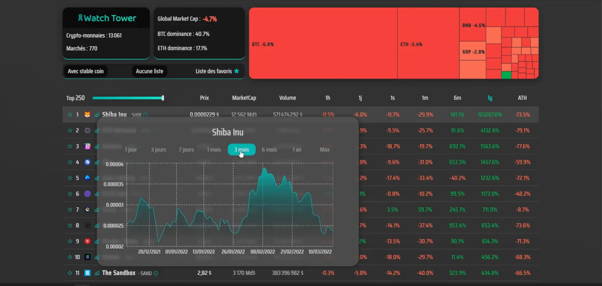

# Crypto Watch Tower

TP du cours "React de A à Z" par From Scratch. Dashboard permettant une veille sur les cryptos monnaies. Entraînement à la manipulation de données via une API.
Première approche de Redux.

